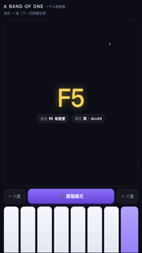
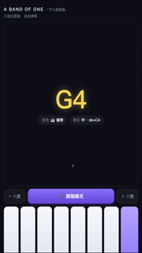
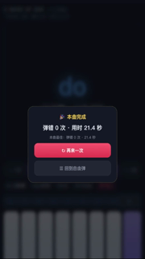

# A Band of One · 一个人的乐队

一个无需安装、无需服务器、下载后即可在电脑浏览器中打开的迷你乐队网页应用。点击网页琴键即可演奏，S8 切换音色，八度按钮切换音区；也可以选择内置曲谱，跟随提示完成演奏。

## 项目演示视频

<!--
视频由 GitHub Issue 媒体附件承载，地址保持单独成段以便 GitHub 渲染播放器。
-->

https://github.com/user-attachments/assets/315bc234-2760-4b3c-a9b9-ffb1bb3f6ad5

## 电脑端快速开始

1. 点击本仓库页面右上角 **Code → Download ZIP**。
2. 解压下载的 ZIP 文件。
3. 双击解压后根目录中的 `index.html`。
4. 使用鼠标或触控板点击网页琴键；第一次点击会解锁浏览器音频。

推荐使用最新版 Chrome 或 Edge。项目是纯静态网页，不需要安装 npm、Python 或其他构建工具，也不需要启动本地服务器或连接硬件。

## 玩法与功能

- **自由演奏**：点击 do、re、mi、fa、sol、la、si 七个琴键即可演奏。
- **三种音色**：钢琴、弦乐、单簧管；点击 S8 乐器键循环切换。
- **三个音区**：使用“− 八度”和“＋ 八度”切换音区。
- **跟随模式**：从内置曲谱中选择曲目，按照红色提示按键；弹错不会推进曲谱，并记录错误次数与用时。
- **结果记录**：完成曲目后显示本次成绩，并在浏览器本地保存最佳成绩。
- **离线可用**：运行代码和音频均随仓库提供，网页运行不依赖网络请求。

“63 个音”在本项目中指 **3 种乐器 × 3 个音区 × 7 个按键 = 63 个演奏位置**。由于弦乐和单簧管的天然音区有重叠，当前发布包实际包含 **51 个独立零变调采样**：钢琴 21 个、弦乐 15 个、单簧管 15 个。每个演奏位置都直接调用对应原音，不进行播放时升降调。

## 界面预览

下面三张图分别展示自由演奏、跟随模式和曲终结果。图片均为项目自有界面截图。

| 自由演奏 | 跟随模式 | 曲终结果 |
|---|---|---|
|  |  |  |

## 小红书项目 32

本项目对应的小红书项目：

[我用AI做了支乐队，点开就能弹🎵 - rAIBOl](https://www.xiaohongshu.com/discovery/item/6a9e3cd4000000002a02c7e2?source=webshare&xhsshare=pc_web&xsec_token=ABzYOFpqTmpDRz2703YTD1sUQK3W-SCpE4rrOlKTT4H54=&xsec_source=pc_share)

README 侧重电脑网页端的下载和使用；小红书账号登录、发布和笔记管理需要由用户自行完成。

## 技术实现

- 原生 HTML、CSS、JavaScript，无框架、无构建步骤。
- Web Audio API 在首次用户点击后创建或恢复音频上下文。
- Canvas 2D 用于演奏反馈和跟随模式中的视觉效果。
- `localStorage` 仅用于保存浏览器本地的最佳成绩。
- 音频同时提供内嵌数据和 `audios/*.mp3` 本地文件回退路径。

## 文件结构

```text
.
├── index.html          # 直接双击打开的网页入口
├── app.js              # 模式、曲谱、音色和交互逻辑
├── fx.js               # Canvas 视觉反馈
├── audio-data.js       # 内嵌音频数据
├── audios/             # 本地 MP3 回退音频
├── assets/screenshots/ # README 界面截图
├── docs/
│   ├── ARCHITECTURE.md # 运行结构与离线边界
│   └── AUDIO_SOURCES.md # 音频来源、处理和许可证
├── LICENSE             # 项目自有代码与文档的 MIT 许可证
└── THIRD_PARTY_NOTICES.md
```

## 音频来源与许可证

音频来源、上游项目、许可证、处理参数和文件范围见 [docs/AUDIO_SOURCES.md](docs/AUDIO_SOURCES.md)。第三方许可边界见 [THIRD_PARTY_NOTICES.md](THIRD_PARTY_NOTICES.md)。

- 钢琴采样：`nbrosowsky/tonejs-instruments`，采样按 CC BY 3.0 使用。
- 弦乐和单簧管采样：`gleitz/midi-js-soundfonts` 中的 Musyng Kite 音色，音色按 CC BY-SA 3.0 使用。
- 本项目自有网页代码和文档：MIT License。

## 常见问题

### 双击后没有声音怎么办？

先点击任意一个网页琴键，浏览器通常只允许在用户操作后播放声音。随后检查浏览器标签页是否被静音，并确认 `audios/` 目录与 `index.html` 位于同一发布根目录。

### 是否需要安装依赖或启动服务器？

不需要。发布包设计为直接打开根目录 `index.html`。如果某些浏览器对 `file://` 音频策略限制较严格，可用 Chrome 或 Edge 打开；仍有问题时再使用任意静态文件服务器提供该目录。

### 是否支持电脑物理键盘按键？

当前公开版的主要操作方式是鼠标或触控板点击网页琴键，README 不把物理键盘映射作为已交付功能。
